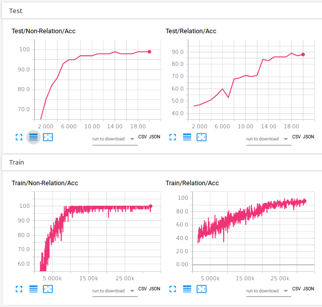

Pytorch re-implementation of Relational Module for Relational Reinforcement Learning (RRL) based on Multi-Head Dot-Product Attention (MHDPA) - [Relational Deep Reinforcement Learning](https://arxiv.org/abs/1806.01830). 

Contrary to testing in RL setting like in the paper, here we test on Sort-of-CLEVR in order to compare with other implementation relevant to that benchmark.

## Sort-of-CLEVR

Sort-of-CLEVR is a simplified version of [CLEVR](http://cs.stanford.edu/people/jcjohns/clevr/). It is composed of 10000 images and 20 questions (10 relational questions and 10 non-relational questions) for each image. For each image, 6 colors (red, green, blue, orange, gray, yellow) are assigned to randomly chosen shape (square or circle).

Please refer to the links in the disclaimer for even more details.

## Requirements

Tested with :

- Python 3.5
- numpy==1.14.5
- torch==0.4.1
- torchvision==0.1.9
- opencv-python==3.4.1.15
- tensorboard==1.10.0
- tensorboardX==1.4
- (tensorflow==1.10.0)

## Usage

Best settings :
* use LeakyReLU (give better results than ReLU ('withReLU' argument) )
* Adam optimizer
* learning rate : 1e-4 (default)
* batch size : 64 (default)
* number of MHDPA head :: 'nbrModule' : 4
* number of recurrent application :: 'nbrRecurrentSharedLayer' : 2
* layer normalization applied after the key,query, and value generators : [x]
* dimension of the key, query, and value interaction vectors :: 'interactions_dim' : 128 
* number of hidden neurons per MLP layer :: 'units_per_MLP_layer' : 128
* dropout probability :: 'dropout_prob' : 0.0 (default)

Train using :

 	 $ python main.py --model=MHDPA-RN --epochs=20 --nbrModule=4 --nbrRecurrentSharedLayer=2 --withLNGenerator --interactions_dim=128 --units_per_MLP_layer=128 

## Results

| | Relational (MHDPA) Module (20th epoch) | Relational Networks (20th epoch) | CNN + MLP (without RN, 100th epoch) |
| --- | --- | --- | --- |
| Non-relational question | 99% | 99% | 66% |
| Relational question | 88% | 89% | 66% |

You can observe the results in Tensorboard via TensorboardX :

## Disclaimer

This work extends the work of [@kimhc6028](https://github.com/kimhc6028) on [Relational Network](https://github.com/kimhc6028/relational-networks) to the Relational Module based on MHDPA, and described in [Relational Deep Reinforcement Learning](https://arxiv.org/abs/1806.01830).