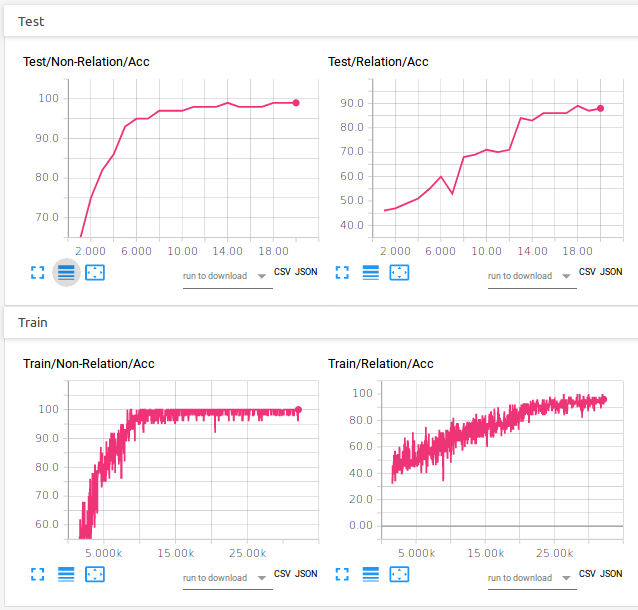
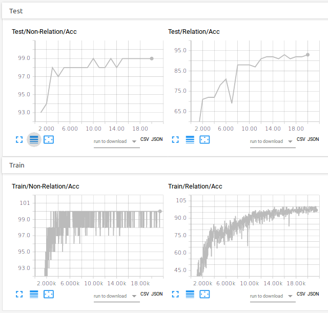

Pytorch re-implementation of Sequential Attention Relation Network (SARN) - [SARN: Relational Reasoning through Sequential Attention](https://arxiv.org/abs/1811.00246). 

We test on Sort-of-CLEVR in order to compare with other implementation relevant to that benchmark.

## Sort-of-CLEVR

Sort-of-CLEVR is a simplified version of [CLEVR](http://cs.stanford.edu/people/jcjohns/clevr/). It is composed of 10000 images and 20 questions (10 relational questions and 10 non-relational questions) for each image. For each image, 6 colors (red, green, blue, orange, gray, yellow) are assigned to randomly chosen shape (square or circle).

Please refer to the links in the disclaimer for even more details.

## Requirements

Tested with :

- Python 3.5
- numpy==1.14.5
- torch==0.4.1
- torchvision==0.1.9
- opencv-python==3.4.1.15
- tensorboard==1.10.0
- tensorboardX==1.4
- (tensorflow==1.10.0)

## Usage

Best settings :
* use LeakyReLU
* Adam optimizer
* learning rate : 1e-4 (default)
* batch size : 96 
* layer normalization in the g function: [ ]
* xavier initialization : [ ]
* number of hidden neurons per MLP layer in the a_psi, g, and f functions :: 'units_per_MLP_layer' : 1024
* dropout probability in the f function : 0.5 (default)

Train using :

 	 $ python main.py --model=SARN --epochs=20 --units_per_MLP_layer=1024 --conv_dim=24 --batch-size=96 --withLeakyReLU --withSoftmaxWeights  --NoXavierInit

## Results

| Sequential Attention Relation Network (20th epoch) | Relational (MHDPA) Module (20th epoch) | Relational Networks (20th epoch) | CNN + MLP (without RN, 100th epoch) |
| --- | --- | --- | --- |
| Non-relational question | 99% | 99% | 99% | 66% |
| Relational question | 93% | 88% | 89% | 66% |

You can observe the results in Tensorboard via TensorboardX :

- Relational (MHDPA) Module :

- Sequential Attention Relation Network :

## Disclaimer

This work extends the work of [@kimhc6028](https://github.com/kimhc6028) on [Relational Network](https://github.com/kimhc6028/relational-networks) to the Relational Module based on MHDPA (described in [Relational Deep Reinforcement Learning](https://arxiv.org/abs/1806.01830)) and SARN.